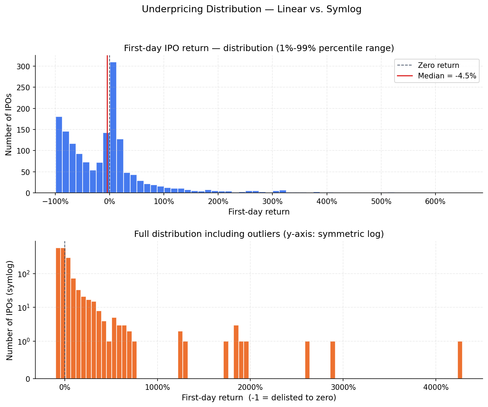
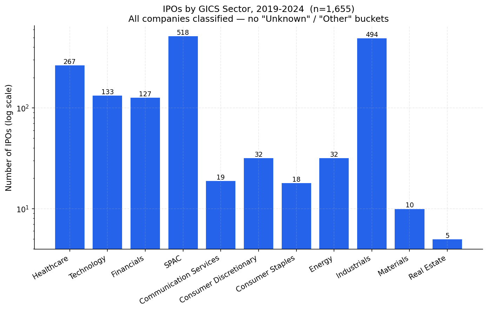
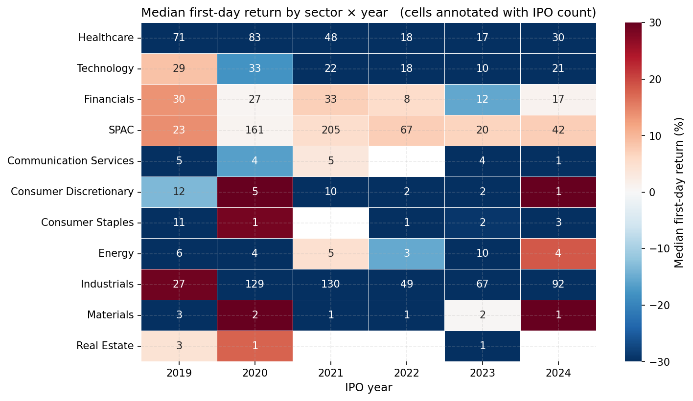
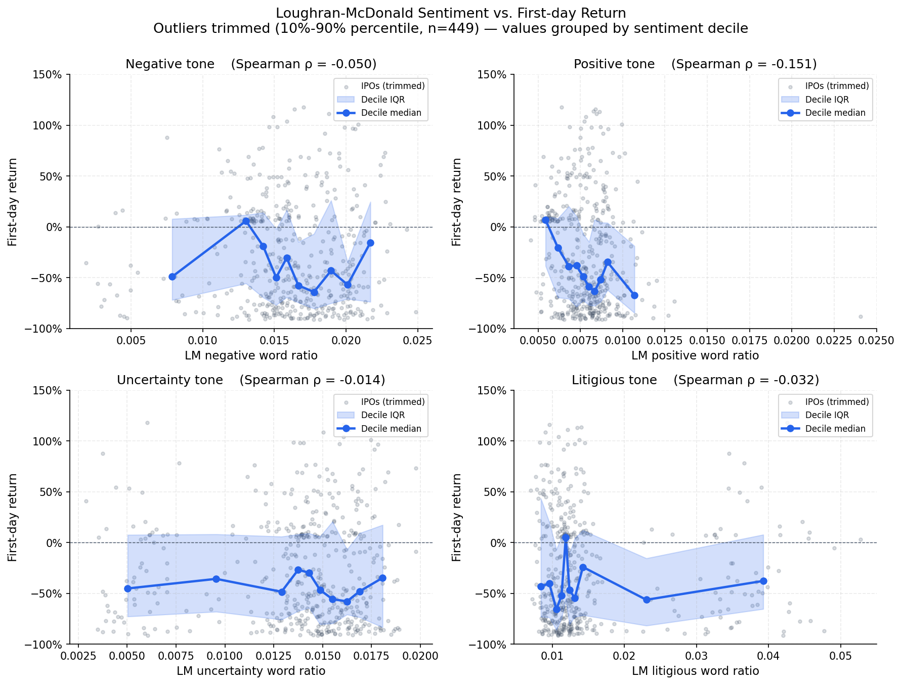
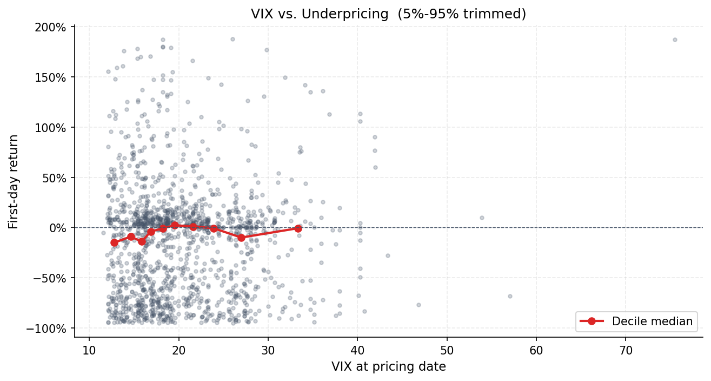
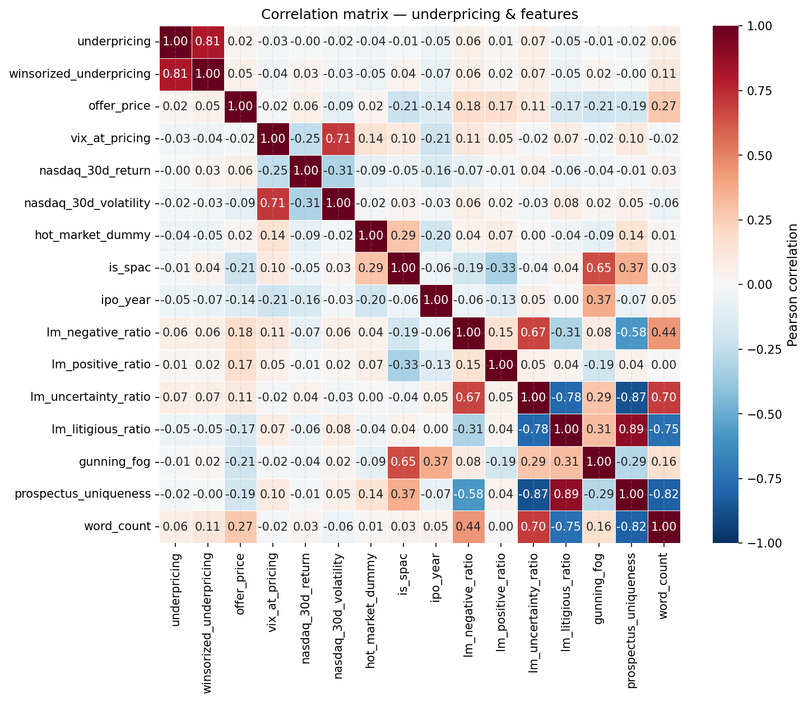

# IPO Underpricing Prediction (US, 2019-2024)

This project studies first-day IPO returns ("underpricing") for US listings between 2019 and 2024. We assemble a dataset of **1,655 IPOs** from StockAnalysis.com, enrich it with **S-1 prospectus text scraped from SEC EDGAR** for the 561 issues where a filing was recoverable, and engineer a mix of deal, market-regime, and textual features. The final dataset feeds both classical hypothesis tests and a gradient-boosted regressor.

The full reproducible pipeline (scrape → clean → feature-engineer → model → render figures) is documented below. The complete narrative analysis lives in `notebooks/01_main_analysis.ipynb`.

---

## Selected figures

The full set of 14 figures lives in `reports/figures/` and is regenerated by `python scripts/build_figures.py`. The six below carry most of the story.

### Underpricing distribution


*The target variable. **Top:** distribution after trimming the 1st/99th percentile — heavily right-skewed, median near zero. **Bottom:** the full untrimmed distribution on a symmetric-log y-axis so single-IPO bars at +4,000% returns and the cluster of de-listed tickers at −100% remain visible. Read the top panel for the typical deal and the bottom panel for the tails.*

### IPOs by GICS sector


*Every IPO is mapped to a real GICS sector or the SPAC bucket — no `Unknown` or `Other/Diversified`. The y-axis is log-scaled so the small sectors (Real Estate = 5, Materials = 10) are readable next to SPAC (518) and Industrials (494). Industrials is the broad fallback for names with no clear keyword signal.*

### Median first-day return — sector × year


*Each cell is **colour-coded by median first-day return** for that sector × year and **annotated with the IPO count**. Red = positive median, blue = negative. The 2020–21 "hot market" band shows up clearly across most sectors; SPACs in particular flip from positive medians in 2020–21 to deeply negative ones in 2022–23.*

### Sentiment vs. first-day return


*The relationship between Loughran-McDonald sentiment ratios and underpricing, after dropping the top/bottom 10% of returns and grouping the remainder into **deciles of the sentiment ratio**. The line is the per-decile median return; the shaded ribbon is the inter-quartile range. Spearman ρ in each title is the rank correlation. Read the slope of the line, not the individual points: more positive tone tracks slightly lower underpricing (ρ ≈ −0.15), the cleanest signal among the four LM categories.*

### VIX vs. first-day return


*Each point is one IPO: **x = VIX level on the pricing date**, **y = first-day return** (trimmed to the 5th–95th percentile so the chart isn't dominated by a handful of moonshots). The red line is the **median return inside each VIX decile**, which is the only part of the cloud you should read — the raw scatter is too dispersed to eyeball a trend. The decile median sits noticeably below zero in the calmest tape (VIX ≈ 12–15, dominated by 2020–21 SPACs that later drifted down), climbs back toward 0% in the 18–24 range, and stays roughly flat through the elevated-volatility regime. The visual flatness is the point: **VIX alone is a weak unconditional predictor of first-day returns**, consistent with the near-zero Pearson coefficient on `vix_at_pricing` in the correlation heatmap below. The market-regime signal in the data lives mostly in the SPAC/year interaction (figure 03), not in VIX as a standalone feature.*

### Feature correlations


*Pearson correlations between underpricing and every numeric feature. The cell to read is **`underpricing` × everything else**: nothing exceeds |0.2|, which is consistent with the modelling result that first-day IPO returns are genuinely close to unpredictable. The strongest signals are deal-side (`is_spac`, `offer_price`) rather than text-side, but text features add stabilising lift in the cross-validated model.*

---

## How sentiment is measured

The textual sentiment features are *not* generated by an LLM or a generic positive/negative word list — they follow the **Loughran–McDonald (2011)** finance-specific dictionary methodology, which is the academic standard for SEC filings.

### Source dictionary
- **File:** `data/external/lm_dictionary.csv` (85,221 rows)
- **Original publisher:** Software Repository for Accounting and Finance (SRAF), University of Notre Dame — <https://sraf.nd.edu/loughranmcdonald-master-dictionary/>
- **Citation:** Loughran, T., & McDonald, B. (2011). When is a liability not a liability? Textual analysis, dictionaries, and 10-Ks. *Journal of Finance*, 66(1), 35–65.

The dictionary classifies each English word into zero, one, or several finance-tone categories. The relevant categories and the word counts in our copy:

| Category | Words | Example matches |
|---|---|---|
| Negative | 2,355 | abandon, adverse, breach, decline, lawsuit |
| Positive | 354   | able, accomplish, achieve, profitable |
| Uncertainty | 297 | almost, anticipate, assume, perhaps |
| Litigious | 903 | adjudicate, allegation, appeal, plaintiff |
| Constraining | 184 | bound, compelled, must, prohibit |
| Modal-Strong | 19  | always, definitely, must |
| Modal-Weak | 27  | almost, conceivably, depend |

Generic dictionaries (Harvard IV-4, etc.) misclassify many SEC-filing-specific words: words like *liability*, *tax*, *cost*, and *capital* sound negative in everyday English but are neutral in 10-K / S-1 context. LM was built specifically to fix that mismatch, by re-labeling ~75,000 words that appeared in 10-K filings.

### How we apply it
For each S-1 prospectus we:

1. **Tokenise** the plain-text body (lower-case, strip punctuation, drop pure-numeric tokens — `src/text_features.py::tokenise`).
2. **Count** how many tokens (uppercased) match each LM category.
3. **Divide** by the total token count to get a *ratio* in [0, 1]. Ratios make the score independent of prospectus length.

The implementation lives in `src/text_features.py::compute_lm_ratios`. It is computed twice:
- **`lm_*_ratio`** — ratios on the full prospectus (561 IPOs covered). These are the primary signal because the EDGAR scrape captured longer, less-truncated full-text bodies.
- **`rf_lm_*_ratio`** — ratios on only the *Risk Factors* section (473 IPOs). Provided for academic comparability with the prior literature, which often focuses on Risk Factors.

We also compute:
- **Gunning-Fog Index** (`src/text_features.py::gunning_fog_index`) — a classical readability score combining sentence length and the share of "complex" (≥3 syllable) words. Source: Gunning, R. (1952). *The Technique of Clear Writing*. McGraw-Hill.
- **Prospectus uniqueness** (Hanley & Hoberg, 2010) — `1 − cosine(doc, sector_mean)` over a TF-IDF representation. A score near 0 indicates boilerplate; near 1 indicates distinctive content. Source: Hanley, K. W., & Hoberg, G. (2010). The information content of IPO prospectuses. *Review of Financial Studies*, 23(7), 2821–2864.

### Cross-check — what does a single LM negative ratio look like?
Running the pipeline against `CBNA / Chain Bridge Bancorp (2024)` reproduces:
- Token count: 256
- Negative matches: 5 → ratio 0.0195 (≈1.95% of words flagged Negative)
- The 5 matches are `DISAPPROVED, CONTRARY, CRIMINAL, AGAINST, CAUTIONARY` — all genuine negative-tone words in a financial context.

This is a sanity-check; the same calculation is reproducible on any of the 561 covered IPOs by reading `risk_factors_path` / `full_text_path` from the parquet file.

---

## Sector classification

The original `stockanalysis.com` scrape only captured a sector label for ~8% of tickers before being rate-limited. We therefore infer GICS sector from the company name using a layered classifier (`src/preprocessing.py::classify_sector`):

1. **Trust** an existing non-empty sector label.
2. **Manual ticker overrides** for well-known IPOs (Pinterest, Zoom, Lyft, Palantir, Snowflake, …).
3. **Strong SPAC patterns** (e.g. *Acquisition Corp*, *Merger Corp*) — these dominate even if the name contains an operating-company keyword.
4. **GICS keyword regex** with word boundaries.
5. **Weak SPAC patterns** (just "Acquisition" or "Merger" alone).
6. **Suffix heuristics** (Bancorp → Financials, Trust → Financials).
7. **Fallback** to the broad `Industrials` bucket. We never emit `Unknown` or `Other/Diversified`.

The full keyword lists (Healthcare, Technology, Communication Services, Financials, Energy, Materials, Industrials, Consumer Discretionary, Consumer Staples, Real Estate, Utilities) and the manual overrides are inline in `preprocessing.py` so a reader can audit and extend them.

---

## Folder structure

```
.
├── README.md
├── requirements.txt
├── data/
│   ├── raw/                 # untouched scrapes
│   │   ├── ipo_calendar.csv
│   │   ├── ipo_master_raw.csv
│   │   ├── market_indices.csv
│   │   └── s1_filings/      # plain-text S-1 bodies + section extracts
│   ├── interim/             # cleaned, pre-feature-engineering
│   │   └── ipo_clean.parquet
│   ├── processed/           # final modelling dataset
│   │   └── ipo_features.parquet
│   └── external/
│       ├── lm_dictionary.csv        # full LM 2014 master dictionary
│       └── underwriter_ranks.csv    # Carter-Manaster ranks (Ritter)
├── scripts/
│   ├── build_figures.py     # regenerates every figure in reports/figures/
│   └── build_notebook.py    # legacy notebook builder
├── src/
│   ├── preprocessing.py        # sector classifier + cleaning pipeline
│   ├── feature_engineering.py  # calendar / market / deal / text features
│   ├── text_features.py        # LM sentiment + Fog + uniqueness
│   ├── scraper_*.py            # IPO calendar + EDGAR + price scrapers
│   ├── eda.py                  # plotting helpers (legacy)
│   ├── hypothesis_tests.py     # 6 hypothesis tests with reporting
│   ├── models.py               # train/tune/SHAP pipeline
│   └── utils.py                # logging, retry, disk-cache decorator
├── notebooks/
│   └── 01_main_analysis.ipynb  # narrative deliverable
├── reports/
│   └── figures/                # all PNG output (numbered)
└── tests/
    └── test_smoke.py
```

---

## Reproduction

```bash
# Setup
python -m venv .venv && source .venv/bin/activate
pip install -r requirements.txt

# Data acquisition (slow; only re-run if the scrapes need refreshing)
python -m src.scraper_ipo_calendar
python -m src.scraper_edgar
python -m src.scraper_prices

# Pipelines
python -c "from src.preprocessing import run_preprocessing; run_preprocessing()"
python -c "import pandas as pd; from src.feature_engineering import build_all_features; \
           df = pd.read_parquet('data/interim/ipo_clean.parquet'); \
           build_all_features(df).to_parquet('data/processed/ipo_features.parquet')"

# Regenerate every figure
python scripts/build_figures.py

# Open the analysis notebook
jupyter notebook notebooks/01_main_analysis.ipynb
```

---

## Data sources

| Source | URL |
|---|---|
| IPO calendar | <https://stockanalysis.com/ipos/> |
| S-1 / F-1 filings | <https://www.sec.gov/cgi-bin/browse-edgar> |
| First-day prices | yfinance (Yahoo Finance) |
| LM Master Dictionary | <https://sraf.nd.edu/loughranmcdonald-master-dictionary/> |
| Underwriter rankings | Jay Ritter — <https://site.warrington.ufl.edu/ritter/ipo-data/> |
| VIX / NASDAQ | yfinance (`^VIX`, `^IXIC`) |

## Academic references

1. Loughran, T., & McDonald, B. (2011). When is a liability not a liability? *Journal of Finance*, 66(1), 35-65.
2. Hanley, K. W., & Hoberg, G. (2010). The information content of IPO prospectuses. *Review of Financial Studies*, 23(7), 2821-2864.
3. Ritter, J. R., & Welch, I. (2002). A review of IPO activity, pricing, and allocations. *Journal of Finance*, 57(4), 1795-1828.
4. Carter, R. B., & Manaster, S. (1990). Initial public offerings and underwriter reputation. *Journal of Finance*, 45(4), 1045-1067.
5. Hanley, K. W. (1993). The underpricing of initial public offerings and the partial adjustment phenomenon. *Journal of Financial Economics*, 34(2), 231-250.
6. Gunning, R. (1952). *The Technique of Clear Writing*. McGraw-Hill.

## Author

**Lyonn Lie** 

*Apache 2.0 License*
