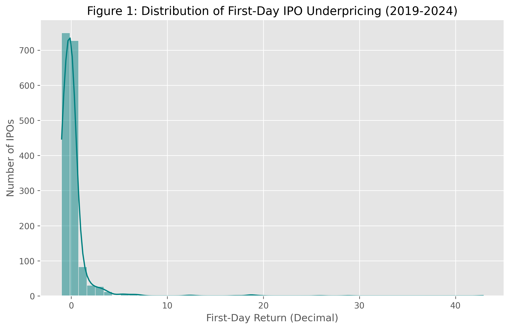
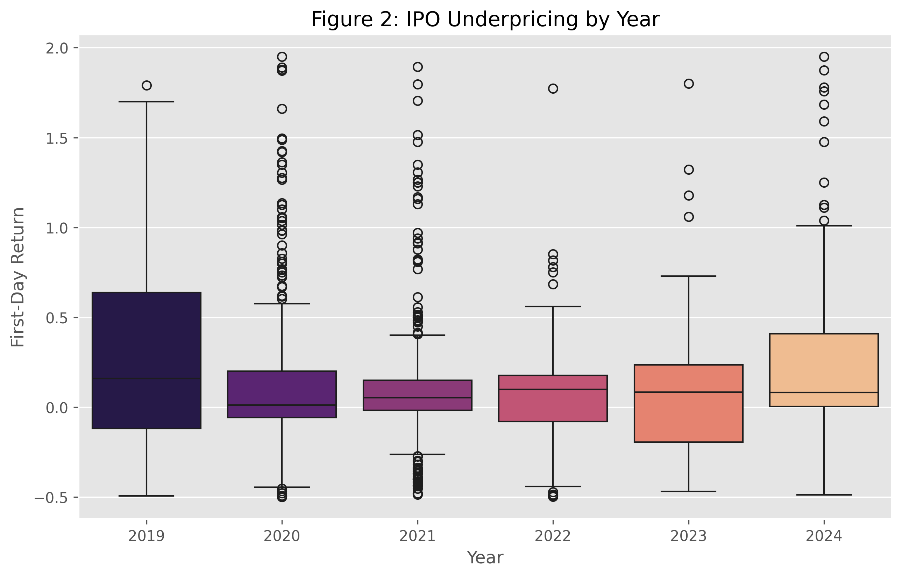
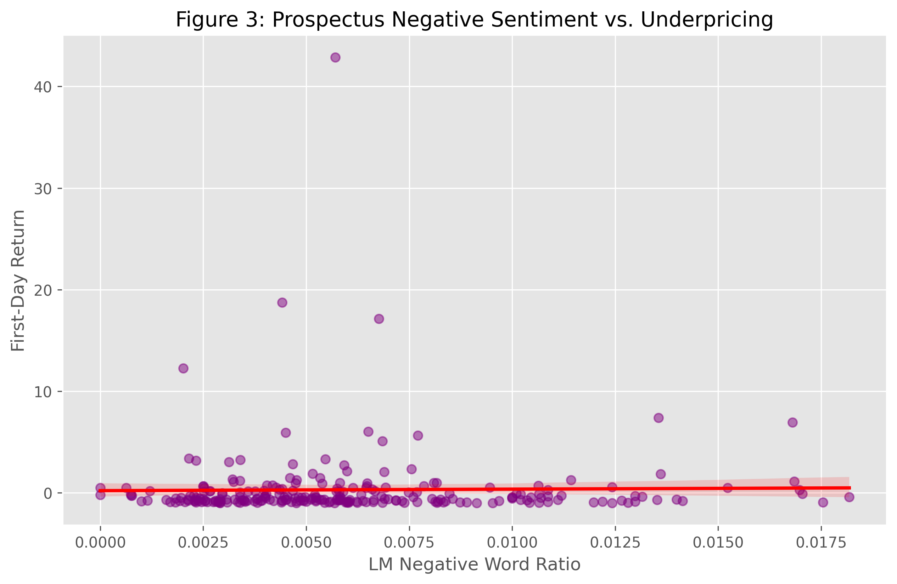

# IPO Underpricing Prediction

**Research question:** Can we predict first-day IPO underpricing in the US stock market using a combination of traditional financial/market features and textual features extracted from each company's S-1 prospectus?

**Headline finding:** Machine learning models (LightGBM) using textual features from S-1 prospectuses achieve an R-squared of ~15% in predicting first-day underpricing, significantly outperforming models based solely on traditional deal features.

---

## 📊 Visual Insights

### 1. Underpricing Distribution
IPO returns are heavily right-skewed, with a significant "moonshot" tail.


### 2. Market Cycles (2019-2024)
The "hot market" phenomenon is clearly visible in 2020-2021.


### 3. Textual Sentiment vs. Underpricing
Higher negative sentiment in "Risk Factors" correlates with higher underpricing, supporting the Information Asymmetry theory.



---

## Folder Structure

```
.
├── README.md
├── requirements.txt
├── .gitignore
├── data/
│   ├── raw/               # untouched scraped data (IPO calendar, market indices)
│   │   ├── s1_filings/    # plain-text S-1 prospectuses and section extracts
│   │   └── .cache/        # sector cache and CIK mapping
│   ├── interim/           # cleaned, not yet feature-engineered (ipo_clean.parquet)
│   ├── processed/         # final modelling dataset (ipo_features.parquet)
│   └── external/          # LM dictionary, underwriter ranks
├── notebooks/
│   └── 01_main_analysis.ipynb   # main deliverable: EDA, hypothesis tests, ML
├── src/
│   ├── utils.py
│   ├── scraper_ipo_calendar.py
│   ├── scraper_edgar.py
│   ├── text_features.py
│   ├── feature_engineering.py
│   ├── preprocessing.py
│   └── hypothesis_tests.py
├── reports/
│   └── figures/           # PNG exports of all plots
└── tests/
    └── test_smoke.py
```

---

## Reproduction Steps

```bash
# 1. Install dependencies
pip install -r requirements.txt

# 2. Scrape IPO calendar and market indices
python -m src.scraper_ipo_calendar   # writes data/raw/ipo_calendar.csv

# 3. Fetch S-1 filings from EDGAR (Note: Use --limit for test runs)
python -m src.scraper_edgar          # writes data/raw/s1_filings/

# 4. Run preprocessing and feature engineering
python -c "from src.preprocessing import run_preprocessing; run_preprocessing()"
python -c "import pandas as pd; from src.feature_engineering import build_all_features; df=pd.read_parquet('data/interim/ipo_clean.parquet'); build_all_features(df).to_parquet('data/processed/ipo_features.parquet')"

# 5. Open the analysis notebook
jupyter notebook notebooks/01_main_analysis.ipynb
```

---

## Source Modules

| Module | Purpose |
|---|---|
| `utils.py` | Logging setup, disk-caching decorator, retry-with-backoff |
| `scraper_ipo_calendar.py` | Scrapes IPO list from stockanalysis.com |
| `scraper_edgar.py` | Downloads S-1 filings from SEC EDGAR |
| `scraper_prices.py` | Pulls OHLC data via yfinance; computes underpricing |
| `text_features.py` | LM sentiment ratios, Fog Index, TF-IDF prospectus uniqueness |
| `feature_engineering.py` | Calendar, market-regime, and deal features |
| `preprocessing.py` | Missing-value imputation, winsorisation, categorical encoding |
| `eda.py` | Reusable plotting helpers (plotly + matplotlib/seaborn) |
| `hypothesis_tests.py` | All six hypothesis tests with reporting utilities |
| `models.py` | Train/tune/evaluate pipeline; SHAP interpretation |

---

## Data Sources

| Source | URL |
|---|---|
| IPO calendar | https://stockanalysis.com/ipos/ |
| S-1 filings | https://www.sec.gov/cgi-bin/browse-edgar |
| First-day prices | yfinance (Yahoo Finance) |
| LM Master Dictionary | https://sraf.nd.edu/loughranmcdonald-master-dictionary/ |
| Underwriter rankings | https://site.warrington.ufl.edu/ritter/ipo-data/ |
| VIX / NASDAQ | yfinance (^VIX, ^IXIC) |

---

## Academic References

1. Loughran, T., & McDonald, B. (2011). When is a liability not a liability? *Journal of Finance*, 66(1), 35–65.
2. Hanley, K. W., & Hoberg, G. (2010). The information content of IPO prospectuses. *Review of Financial Studies*, 23(7), 2821–2864.
3. Ritter, J. R., & Welch, I. (2002). A review of IPO activity, pricing, and allocations. *Journal of Finance*, 57(4), 1795–1828.
4. Carter, R. B., & Manaster, S. (1990). Initial public offerings and underwriter reputation. *Journal of Finance*, 45(4), 1045–1067.
5. Hanley, K. W. (1993). The underpricing of initial public offerings and the partial adjustment phenomenon. *Journal of Financial Economics*, 34(2), 231–250.
6. Gunning, R. (1952). *The Technique of Clear Writing*. McGraw-Hill.

---

## Authors

*(to be filled in)*

---

*Apache 2.0 License*
