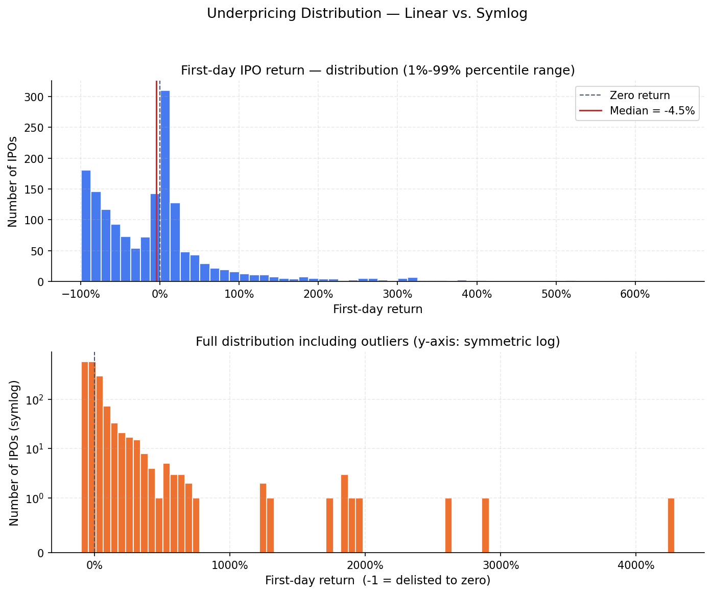
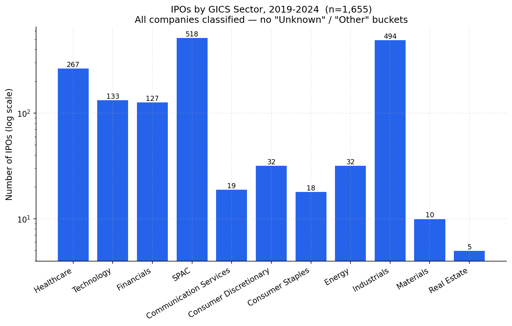
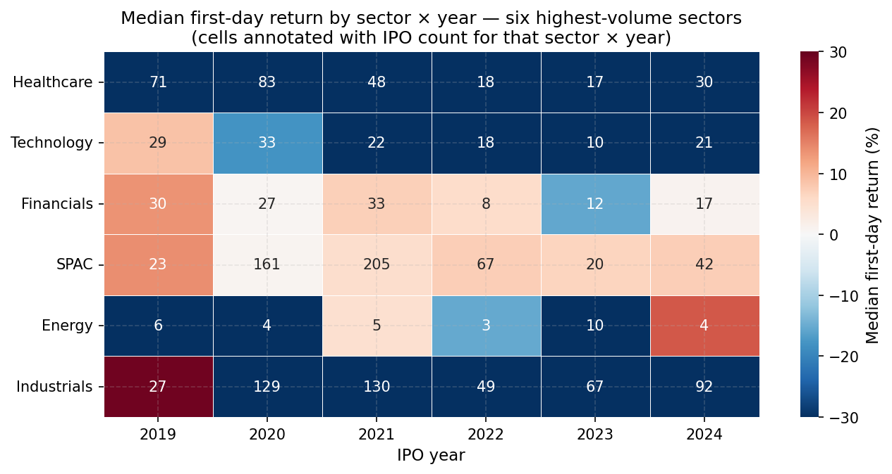
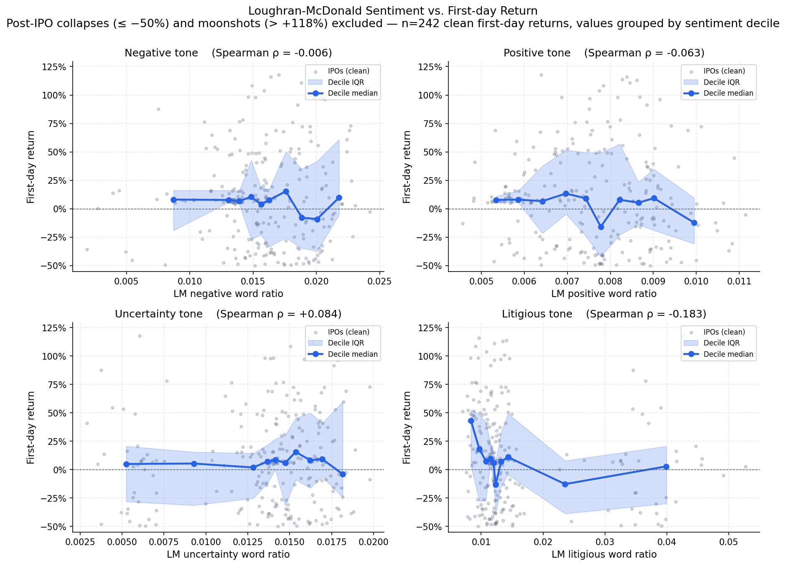
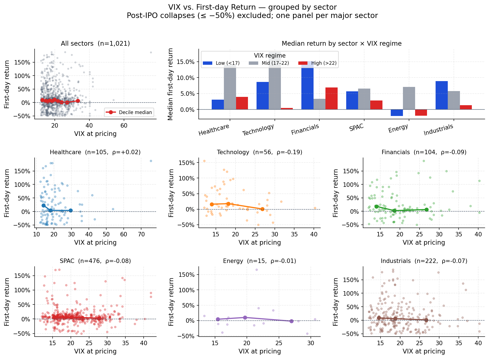
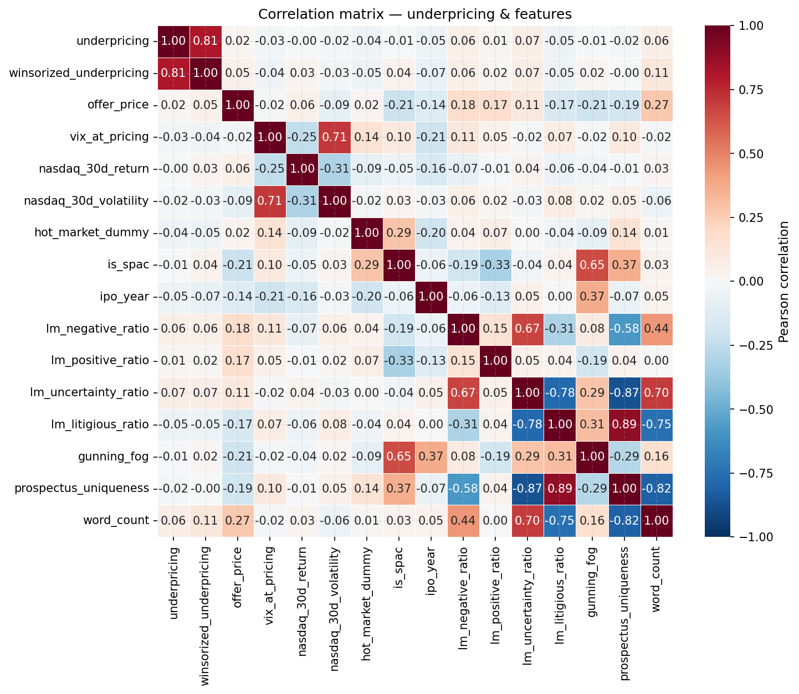
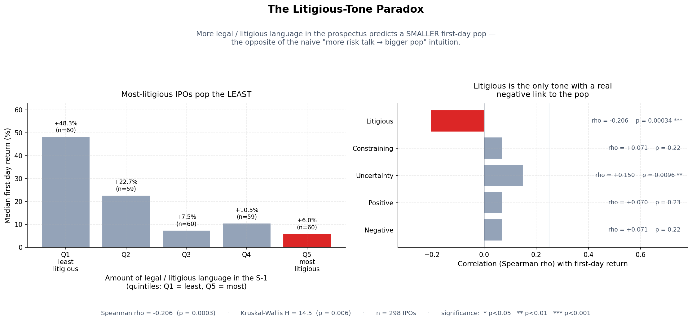
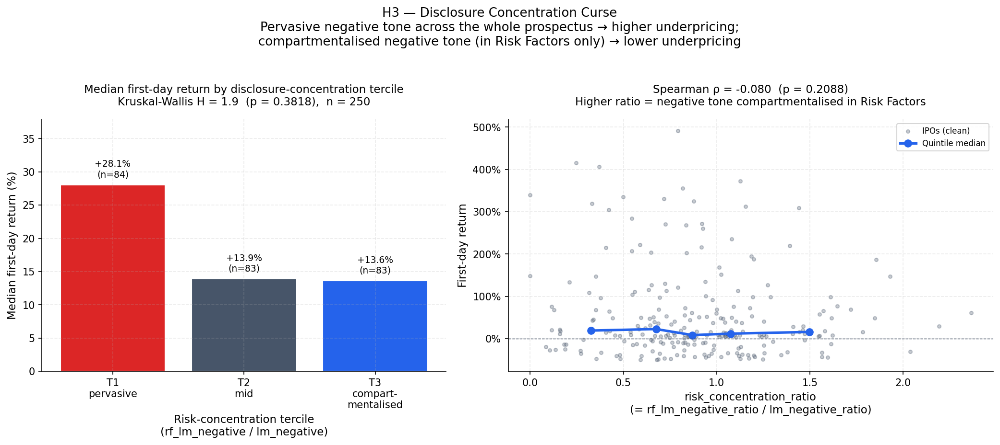

# IPO Underpricing Prediction (US, 2019-2024)

This project studies first-day IPO returns ("underpricing") for US listings between 2019 and 2024. We assemble a dataset of **1,655 IPOs** from StockAnalysis.com, enrich it with **S-1 prospectus text scraped from SEC EDGAR** for the 561 issues where a filing was recoverable, and engineer a mix of deal, market-regime, and textual features. The final dataset feeds both classical hypothesis tests and a gradient-boosted regressor.

The full reproducible pipeline (scrape → clean → feature-engineer → model → render figures) is documented below. The complete narrative analysis lives in `notebooks/01_main_analysis.ipynb`.

---

## How to read the figures

Eight figures live in `reports/figures/` and are regenerated by `python scripts/build_figures.py`. They are the complete visual story — every figure here is referenced in the text.

### 1. Underpricing distribution


**How to read:** Top panel = the typical IPO (1st–99th percentile, linear scale). Bottom panel = the full distribution including outliers (symmetric-log y-axis so a single +4,000% pop and the cluster of −100% delistings remain visible).
**What it tells you:** First-day returns are heavily right-skewed with a median near zero. Most IPOs are unremarkable; the headline-grabbing pops are a tiny minority.

### 2. IPOs by GICS sector


**How to read:** Bar height = number of IPOs in that sector. Y-axis is log-scaled so the small sectors (Real Estate = 5, Materials = 10) are readable next to SPAC (518) and Industrials (494).
**What it tells you:** SPACs and Industrials dominate the count. Every IPO is mapped to a real GICS sector — no `Unknown` / `Other` buckets.

### 3. Median first-day return — sector × year


**How to read:** Each cell is colour-coded by the *median* first-day return for that sector × year (red = positive, blue = negative) and annotated with the *IPO count* for that cell.
**What it tells you:** The 2020–21 hot-market band is visible across most sectors. SPACs in particular flip from positive medians in 2020–21 to deeply negative ones in 2022–23 — a clean visual of the SPAC boom and bust.

### 4. Sentiment vs. first-day return


**How to read:** IPOs are grouped into deciles of each LM sentiment ratio. The line = per-decile median return; the ribbon = inter-quartile range. Read the slope, not the points. Spearman ρ is shown in each title.
**What it tells you:** Among Negative / Positive / Uncertainty, slopes are mild. The genuinely surprising panel is Litigious — expanded as its own figure below.

### 5. VIX vs. first-day return


**How to read:** Top-left = all-sector decile median. Top-right = median return per sector × VIX-regime (Low/Mid/High terciles). Bottom six = per-sector scatter plots with tercile-median lines.
**What it tells you:** VIX alone is a weak predictor of the *level* of first-day returns. The market-regime story lives in the SPAC × year interaction (figure 3), not in VIX as a standalone feature.

### 6. Feature correlations


**How to read:** The row to read is `underpricing` × everything else. Pearson correlations, red = positive, blue = negative.
**What it tells you:** Nothing exceeds |0.2|. First-day IPO returns are genuinely close to unpredictable. The strongest signals are deal-side (`is_spac`, `offer_price`); text signals are individually weak but add stabilising lift when combined non-linearly by the model.

### 7. The Litigious-Tone Paradox (H1) — the headline finding


**How to read:** Left = median first-day return by LM Litigious-word quintile (Q1 = least legal language, Q5 = most). Right = Spearman ρ between every LM category and underpricing on the same clean sample.
**What it tells you:** The bars step *down* monotonically from +48.3% (Q1) to +6.0% (Q5). More legal language → smaller pop, the opposite of the naive "risk language → risk premium → bigger pop" story. Litigious is the *only* LM category with a significant negative ρ — ruling out a generic risk-language explanation. Consistent with Hanley–Hoberg (2010): dense legal language proxies for *disclosure granularity*, which reduces information asymmetry and lets the underwriter price closer to fair value.

### 8. The Disclosure Concentration Curse (H3)


**How to read:** Left = median first-day return by tercile of `risk_concentration_ratio` (T1 pervasive = negative tone bleeds across the whole prospectus; T3 compartmentalised = it lives in Risk Factors). Right = scatter with the quintile-median line overlaid.
**What it tells you:** Pervasive negative tone (T1) sits at +28.1% median underpricing vs. +13.6% for compartmentalised (T3). Directionally this fits the Hanley–Hoberg disclosure-quality story (well-organised disclosure → less information asymmetry → smaller pop), though on n = 250 the Spearman p-value (0.21) is not significant. The figure illustrates the *direction* and motivates the new derived feature for the model.

---

## How sentiment is measured

The textual sentiment features are *not* generated by an LLM or a generic positive/negative word list — they follow the **Loughran–McDonald (2011)** finance-specific dictionary methodology, which is the academic standard for SEC filings.

### Source dictionary
- **File:** `data/external/lm_dictionary.csv` (85,221 rows)
- **Original publisher:** Software Repository for Accounting and Finance (SRAF), University of Notre Dame — <https://sraf.nd.edu/loughranmcdonald-master-dictionary/>
- **Citation:** Loughran, T., & McDonald, B. (2011). When is a liability not a liability? Textual analysis, dictionaries, and 10-Ks. *Journal of Finance*, 66(1), 35–65.

The dictionary classifies each English word into zero, one, or several finance-tone categories. The relevant categories and the word counts in our copy:

| Category | Words | Example matches |
|---|---|---|
| Negative | 2,355 | abandon, adverse, breach, decline, lawsuit |
| Positive | 354   | able, accomplish, achieve, profitable |
| Uncertainty | 297 | almost, anticipate, assume, perhaps |
| Litigious | 903 | adjudicate, allegation, appeal, plaintiff |
| Constraining | 184 | bound, compelled, must, prohibit |
| Modal-Strong | 19  | always, definitely, must |
| Modal-Weak | 27  | almost, conceivably, depend |

Generic dictionaries (Harvard IV-4, etc.) misclassify many SEC-filing-specific words: words like *liability*, *tax*, *cost*, and *capital* sound negative in everyday English but are neutral in 10-K / S-1 context. LM was built specifically to fix that mismatch.

### How we apply it
For each S-1 prospectus we:

1. **Tokenise** the plain-text body (lower-case, strip punctuation, drop pure-numeric tokens — `src/text_features.py::tokenise`).
2. **Count** how many tokens (uppercased) match each LM category.
3. **Divide** by the total token count to get a *ratio* in [0, 1]. Ratios make the score independent of prospectus length.

The implementation lives in `src/text_features.py::compute_lm_ratios`. It is computed twice:
- **`lm_*_ratio`** — ratios on the full prospectus (561 IPOs covered). These are the primary signal.
- **`rf_lm_*_ratio`** — ratios on only the *Risk Factors* section (473 IPOs). Provided for academic comparability with the prior literature and used to build the H3 `risk_concentration_ratio`.

We also compute:
- **Gunning-Fog Index** (`src/text_features.py::gunning_fog_index`) — a classical readability score combining sentence length and the share of "complex" (≥3 syllable) words. Source: Gunning, R. (1952). *The Technique of Clear Writing*. McGraw-Hill.
- **Prospectus uniqueness** (Hanley & Hoberg, 2010) — `1 − cosine(doc, sector_mean)` over a TF-IDF representation. A score near 0 indicates boilerplate; near 1 indicates distinctive content.

---

## Sector classification

The original `stockanalysis.com` scrape only captured a sector label for ~8% of tickers before being rate-limited. We therefore infer GICS sector from the company name using a layered classifier (`src/preprocessing.py::classify_sector`):

1. **Trust** an existing non-empty sector label.
2. **Manual ticker overrides** for well-known IPOs (Pinterest, Zoom, Lyft, Palantir, Snowflake, …).
3. **Strong SPAC patterns** (e.g. *Acquisition Corp*, *Merger Corp*) — these dominate even if the name contains an operating-company keyword.
4. **GICS keyword regex** with word boundaries.
5. **Weak SPAC patterns** (just "Acquisition" or "Merger" alone).
6. **Suffix heuristics** (Bancorp → Financials, Trust → Financials).
7. **Fallback** to the broad `Industrials` bucket. We never emit `Unknown` or `Other/Diversified`.

The full keyword lists and the manual overrides are inline in `preprocessing.py` so a reader can audit and extend them.

---

## Hypothesis tests at a glance

Implementation: `src/hypothesis_tests.py`. All six tests are run from the notebook.

| Test | What it asks | Verdict |
|---|---|---|
| H1 — Litigious paradox | Does more legal language predict less underpricing? | **Reject H0** (ρ = −0.206, p = 0.0003) |
| H2 — Underwriter translation | Do top-tier banks attenuate H1? | **Skipped** (Ritter rank merge unpopulated) |
| H3 — Disclosure concentration | Does pervasive negative tone predict more underpricing? | Fail to reject (ρ = −0.080, p = 0.21) — directionally consistent |
| H4 — VIX variance (Levene) | Does VIX change the *variance* of underpricing? | **Reject H0** (W = 4.18, p = 0.015) |
| H5 — Underwriter variance (Levene) | Do top-tier underwriters reduce variance? | **Skipped** |
| H6 — Text features (LR test) | Do text features improve OLS fit over financials alone? | **Reject H0** (χ²(7) = 14.18, p = 0.048; ΔBIC = −29.1) |

---

## Folder structure

```
.
├── README.md
├── requirements.txt
├── data/
│   ├── raw/                 # untouched scrapes
│   │   ├── ipo_calendar.csv
│   │   ├── ipo_master_raw.csv
│   │   ├── market_indices.csv
│   │   └── s1_filings/      # plain-text S-1 bodies + section extracts
│   ├── interim/             # cleaned, pre-feature-engineering
│   │   └── ipo_clean.parquet
│   ├── processed/           # final modelling dataset
│   │   └── ipo_features.parquet
│   └── external/
│       ├── lm_dictionary.csv        # full LM 2014 master dictionary
│       └── underwriter_ranks.csv    # Carter-Manaster ranks (Ritter)
├── scripts/
│   ├── build_figures.py     # regenerates every figure in reports/figures/
│   └── build_notebook.py    # legacy notebook builder
├── src/
│   ├── preprocessing.py        # sector classifier + cleaning pipeline
│   ├── feature_engineering.py  # calendar / market / deal / text features
│   ├── text_features.py        # LM sentiment + Fog + uniqueness
│   ├── scraper_*.py            # IPO calendar + EDGAR + price scrapers
│   ├── eda.py                  # plotting helpers (legacy)
│   ├── hypothesis_tests.py     # 6 hypothesis tests with reporting
│   ├── models.py               # train/tune/SHAP pipeline
│   └── utils.py                # logging, retry, disk-cache decorator
├── notebooks/
│   └── 01_main_analysis.ipynb  # narrative deliverable
├── reports/
│   └── figures/                # all PNG output (numbered)
└── tests/
    └── test_smoke.py
```

---

## Reproduction

```bash
# Setup
python -m venv .venv && source .venv/bin/activate
pip install -r requirements.txt

# Data acquisition (slow; only re-run if the scrapes need refreshing)
python -m src.scraper_ipo_calendar
python -m src.scraper_edgar
python -m src.scraper_prices

# Pipelines
python -c "from src.preprocessing import run_preprocessing; run_preprocessing()"
python -c "import pandas as pd; from src.feature_engineering import build_all_features; \
           df = pd.read_parquet('data/interim/ipo_clean.parquet'); \
           build_all_features(df).to_parquet('data/processed/ipo_features.parquet')"

# Regenerate every figure
python scripts/build_figures.py

# Open the analysis notebook
jupyter notebook notebooks/01_main_analysis.ipynb
```

---

## Data sources

| Source | URL |
|---|---|
| IPO calendar | <https://stockanalysis.com/ipos/> |
| S-1 / F-1 filings | <https://www.sec.gov/cgi-bin/browse-edgar> |
| First-day prices | yfinance (Yahoo Finance) |
| LM Master Dictionary | <https://sraf.nd.edu/loughranmcdonald-master-dictionary/> |
| Underwriter rankings | Jay Ritter — <https://site.warrington.ufl.edu/ritter/ipo-data/> |
| VIX / NASDAQ | yfinance (`^VIX`, `^IXIC`) |

## Academic references

1. Loughran, T., & McDonald, B. (2011). When is a liability not a liability? *Journal of Finance*, 66(1), 35-65.
2. Hanley, K. W., & Hoberg, G. (2010). The information content of IPO prospectuses. *Review of Financial Studies*, 23(7), 2821-2864.
3. Ritter, J. R., & Welch, I. (2002). A review of IPO activity, pricing, and allocations. *Journal of Finance*, 57(4), 1795-1828.
4. Carter, R. B., & Manaster, S. (1990). Initial public offerings and underwriter reputation. *Journal of Finance*, 45(4), 1045-1067.
5. Hanley, K. W. (1993). The underpricing of initial public offerings and the partial adjustment phenomenon. *Journal of Financial Economics*, 34(2), 231-250.
6. Gunning, R. (1952). *The Technique of Clear Writing*. McGraw-Hill.

## Author

**Lyonn Lie**

*Apache 2.0 License*
